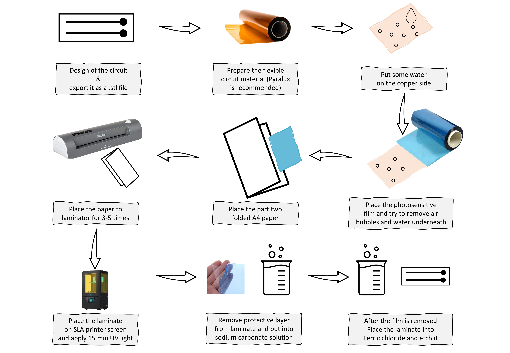

# Flexible Printed Circuits;
Here is the proposal of workflow to fabricate flexible circuits. What makes the difference in this workflow than the other printed circuits is that simple SLA/LCD printer is used to mask the circuit traces. From beginning to end, this workflow takes 45-60 min to finish a circuit.

Bill of Materials (BOM);
- P

*Workflow;

